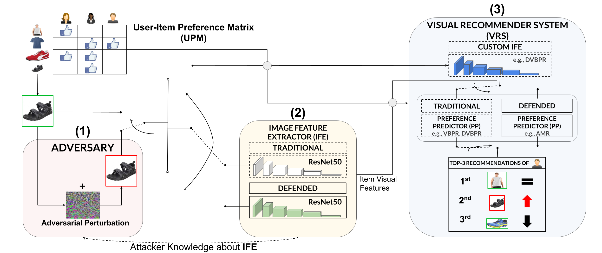

# An Empirical Study of DNNs Robustification Inefficacy in Protecting Visual Recommenders
Here is the architectural scheme of our proposed framework:



**Table of Contents:**
- [Requirements](#requirements)
- [Reproduce paper results](#reproduce-paper-results)
  - [Image classification and feature extraction](#1-image-classification-and-feature-extraction)
  - [Recommendations generation](#2-recommendations-generation)
  - [Visual attacks](#3-visual-attacks)
  - [Recommendations generation after attack](#4-recommendations-generation-after-attack)
  - [Attack Success Rate and Feature Loss](#5-attack-success-rate-and-feature-loss)
  - [EXTRA: script input parameters](#extra-script-input-parameters)
- [Datasets, pre-trained defense models and attack parameters](#datasets-pre-trained-defense-models-and-attack-parameters)
  - [Datasets](#datasets)
  - [Pre-trained defended models](#pre-trained-defense-models)
  - [Attack parameters](#attack-parameters)

## Requirements

To begin with, please make sure your system has these installed:

* Python 3.6.8
* CUDA 10.1
* cuDNN 7.6.4

Then, install all required Python dependencies with the command:
```
pip install -r requirements.txt
```

To download and place correctly all datasets, run the bash script ```download_datasets.sh```.

This will create the following directory tree:
```
./data
  amazon_men/
    original/
       images/
        0.jpg
        1.jpg
        ...
  amazon_women/
    original/
      images/
        0.jpg
        1.jpg
        ...
  tradesy/
    original/
      images/
        0.jpg
        1.jpg
        ...
```

## Reproduce paper results

Here we describe the steps to reproduce the results presented in the paper. [Here](#extra-script-input-parameters) we explain in depth some of the script input parameters we use.

### 1. Image classification and feature extraction
First of all, classify all images from one of the three datasets and extract high-level features by running:
```
python classify_extract.py \
  --dataset <dataset_name> \
  --defense 0 \
  --gpu <gpu_id>
```
If you want to classify images with a defended model (i.e., Adversarial Training or Free Adversarial Training), run the following
```
python classify_extract.py \
  --dataset <dataset_name> \
  --gpu <gpu_id> \
  --defense 1 \
  --model_dir <model_name> \
  --model_file <model_filename>
```
This will produce ```classes.csv``` and ```features.npy```, which is a ```N X 2048``` float32 array corresponding to the extracted features for all ```N``` images. The two files are saved to ```./data/<dataset_name>/original/``` when no defense is applied, otherwise they are saved to ```./data/<dataset_name>/<model_name>_original/```. 

### 2. Recommendations generation
After this initial step, run the following command to train one of the available recommender models based on the extracted visual features:

```
python rec_generator.py \
  --dataset <dataset_name> \
  --gpu <gpu_id> \
  --experiment_name <full_experiment_name> \
  --epoch <num_training_epochs> \
  --verbose <show_results_each_n_epochs> \
  --topk 150
```
The recommeder models will be stored in ```./rec_model_weights/<dataset_name>/``` and the top-150 recommendation lists for each users will be saved in ```./rec_results/<dataset_name>/```. 

Extract the proposed rank-based metrics (CHR@K and nCDCG@K) you can execute the following command:
```
python evaluate_rec.py \
  --dataset <dataset_name> \
  --metric <ncdcg or chr> \
  --experiment_name <full_experiment_name> \
  -- origin <original_class_id> \
  --topk 150 \
  --analyzed_k <metric_k>
```

Results will be stored in ```./chr/<dataset_name>/``` and ```./ncdcg/<dataset_name>/``` in ```.tsv``` format. At this point, you can select from the extracted category-based metrics the origin-target pair of ids to execute the explored VAR attack scenario.

### 3. Visual attacks
Based upon the produced recommendation lists, choose an **origin** and a **target** class for each dataset. Then, run one of the available **targeted** attacks:
```
python classify_extract_attack.py \
  --dataset <dataset_name>  \
  --attack_type <attack_name> \
  [ATTACK_PARAMETERS] \
  --origin_class <zero_indexed_origin_class> \
  --target_class <zero_indexed_target_class> \
  --defense 0 \
  --gpu <gpu_id>
```
If you want to run an attack on a defended model, this is the command to run:
```
python classify_extract_attack.py \
  --dataset <dataset_name> \
  --attack_type <attack_name> \
  [ATTACK_PARAMETERS] \
  --origin_class <zero_indexed_origin_class> \
  --target_class <zero_indexed_target_class> \
  --defense 1 \
  --model_dir <model_name> \
  --model_file <model_filename> \
  --gpu <gpu_id>
```
This will produce (i) all attacked images, saved in ```tiff``` format to ```./data/<dataset_name>/<full_experiment_name>/images/``` and (ii) ```classes.csv``` and ```features.npy```. 

### 4. Recommendations generation after attack
Generate the recommendation lists for the produced visual attacks as specified in [Recommendations generation](#2-recommendations-generation).

### 5. Attack Success Rate and Feature Loss
In order to generate the attack Success Rate (SR) for each attack/defense combination, run the following script:
```
python -u evaluate_attack.py [SAME PARAMETERS SEEN FOR classify_extract_attack.py]
```
this will produce the text file ```./data/<dataset_name>/<full_experiment_name>/success_results.txt```, which contains the average SR results.

Then, to generate the Feature Loss (FL) for each attack/defense combination, run the following script:
```
python -u feature_loss.py [SAME PARAMETERS SEEN FOR classify_extract_attack.py]
```
this will generate the text file ```./data/<dataset_name>/full_experiment_name>/features_dist_avg_all_attack.txt``` with the average FL results, and the csv file ```./data/<dataset_name>/<full_experiment_name>/features_dist_all_attack.csv``` with the FL results for each attacked image. 

### EXTRA: script input parameters
```
# Possible values for 'dataset', 'defense', 'model_dir', 'model_file'
--dataset: {
    amazon_men 
    amazon_women
    tradesy
}

--defense : {
    0 # non-defended model
    1 # defended model
}

--model_dir : {
    madry # free adversarial training
    free_adv # free adversarial training
}

--model_file : {
    imagenet_linf_4.pt # adversarial training model filename
    model_best.pth.tar # free adversarial_training model filename
}

----------------------------------------------------------------------------------

# [ATTACK_PARAMETERS]
--eps # epsilon
--l # L norm

# All other attack parameters are hard-coded. Can be set as input parameters, too.
```

## Datasets, pre-trained defense models and attack parameters
### Datasets

|       Dataset      |    ***k-cores***   | # Users   | # Products   |  # Feedback   |
| ------------------ | ------------------ | ------------------ | ------------------ | ------------------ |
|     Amazon Men     |      5 | 24,379 | 7,371 | 89,020  |
|    Amazon Women    |   10 | 16,668 | 2,981 | 54,473  |
|      Tradesy       |   10 | 6,253 | 1,670 | 21,533 |

[Click here](https://drive.google.com/file/d/1_daGmkBRqv5z201rNUAW1R3C29rPqBEL/view?usp=sharing) to download datasets.

### Pre-trained defense models
|              Model name                 | Description |           Link          |
| --------------------------------------- |-------------|-------------------------|
|    Adversarial Training ([Madry et al.](https://arxiv.org/pdf/1706.06083.pdf))  | <ul><li>model: ResNet50</li><li>dataset: ImageNet</li><li>attack: PGD (epsilon = 4)</li></ul> | [click here](https://github.com/MadryLab/robustness#pretrained-models)|    
|       Free Adversarial Training ([Shafai et al.](https://arxiv.org/pdf/1904.12843.pdf))          | <ul><li>model: ResNet50</li><li>dataset: ImageNet</li><li>attack: FGSM (epsilon = 4)</li><li>other parameters:<ul><li>m = 4</li></ul></li></ul> | [click here](https://gofile.io/d/ZfjwxQ) |

### Attack parameters
All attacks are implemented with [CleverHans](https://github.com/tensorflow/cleverhans).
| Attack name                                                      | Parameters                                                                                                     |
|------------------------------------------------------------------|----------------------------------------------------------------------------------------------------------------|
| FGSM ([Goodfellow et al.](https://arxiv.org/pdf/1412.6572.pdf))    | <ul><li>epsilon = {4, 8} (rescaled by 255)</li></ul>                                                                           |
| PGD ([Madry et al.](https://arxiv.org/pdf/1706.06083.pdf))         | <ul><li>epsilon = {4, 8} (rescaled by 255)</li><li>alpha = epsilon / 6</li><li>iterations = 10</li></ul>                             |
| C & W ([Carlini and Wagner](https://arxiv.org/pdf/1608.04644.pdf)) | <ul><li>binary steps = 5</li><li>initial c = 10e-2</li><li>confidence = 0</li><li>iterations = 1000</li><li>learning rate = 5e-3</li></ul> |
